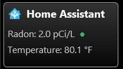
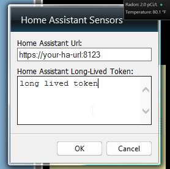

# Home Assistant Windows 7 Gadget

A Windows 7 Sidebar Gadget for displaying Home Assistant sensor data (e.g., radon and temperature sensors).

## Features
- Displays real-time values from your Home Assistant sensors
- Supports radon and temperature sensors (customizable)
- Color-coded radon indicator dot
- Handles unavailable sensor states gracefully
- Easy configuration via gadget settings (wrench icon)

## Requirements
- Windows 7 (Sidebar gadgets enabled), see https://gadgetpack.net/
- Home Assistant instance with API access and a long-lived access token

## Installation
1. Copy or clone this repository to your PC.
2. Run `dev-deploy-gadget.ps1` in PowerShell to deploy the gadget to your Sidebar gadgets folder and restart the Sidebar.
3. Add the gadget to your Windows Sidebar if it does not appear automatically.

## Configuration
1. Click the wrench (settings) icon on the gadget.
2. Enter your Home Assistant URL (e.g., `https://your-ha-url:8123`).
3. Enter your Home Assistant long-lived access token.
4. Save settings and close the settings window.

## Customization
- To change which sensors are displayed, edit the `radonSensorEntityId` and `temperatureSensorEntityId` variables in `main.html`.

## Development
- Use the `dev-deploy-gadget.ps1` script to quickly redeploy changes during development.

## License
See [LICENSE](LICENSE).

---
© 2025 Viktar Karpach
